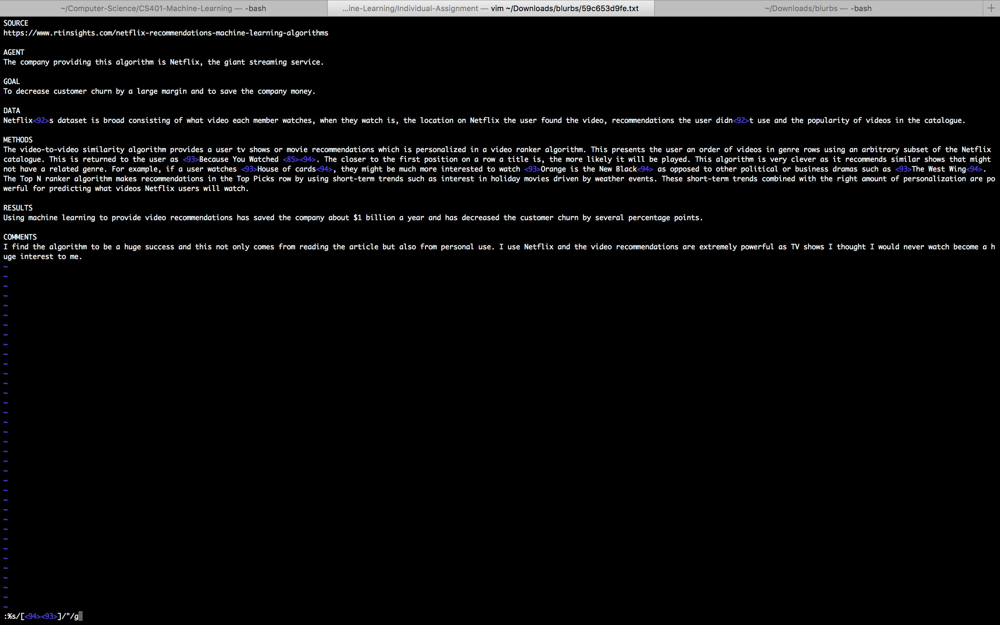

## Naive Bayes Classifier - Sentiment (NLTK)


need to install:
`sudo pip install nltk`

run: `python senti.py `

### Using python shell:


```python
import nltk
from nltk import word_tokenize
```

```python
nltk.downloader()
```
 and download **all** (really just need punkt)

```python
sent = "Hello world. Please tokenize."
word_tokenize(sent)
```

```python
from __future__ import division
import nltk, re, pprint
from nltk import word_tokenize
from nltk.corpus import PlaintextCorpusReader
```

### Issue with Data Provided:

Some files were created using a text rich editors. This meant that they were encoded in non utf8 formats.
Code below:
* python to print all unicode chars that cause issues
* `sed` to replace all chars with nothing
* put to .fix files and then last for loop puts back to .txt

One of problem files found -> blurbs/59c653d9fe.txt



```bash
CHARS=$(python -c 'print u"\u0091\u0092\u00a0\u200E".encode("utf8")')
for i in *; do sed 's/['"$CHARS"']//g' < $i > ${i}.fix; done
for i in $(find . -type f -name '*.fix'); do mv ${i} ${i%.fix}; done
```

**code I like for getting parent directory of a file (used substring in end):**
```python
import os 
print os.path.basename(os.path.dirname("path/to/blurbs/pos/f574b42c31.txt"))
```
*I first converted all files to .txt to try fixing issue (before I knew it was special chars specifically causing the issue)*

```bash
echo 'set encoding=utf-8' >> ~/.vimrc
echo 'set fileencoding=utf-8' >> ~/.vimrc
for file in $(find path/to/blurbs/ -type f); do vim "$file"wq; done
```
